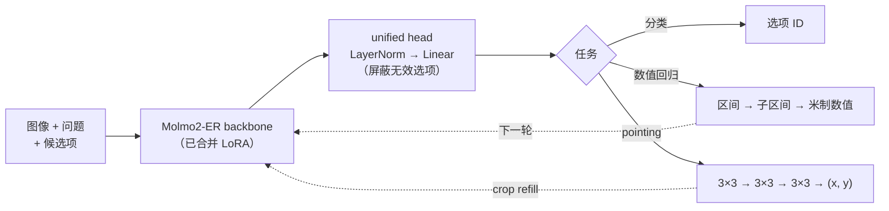

<div align="center">

# Jev-Spatial

**通过有限选项决策，实现快速空间智能**

[](https://github.com/Fr0zenCrane/jev-spatial)
[](https://huggingface.co/Fr0zencr4nE/jev-spatial)
[](https://huggingface.co/allenai/Molmo2-ER)
[](LICENSE)

[English](README.md) · 简体中文

</div>

**Jev-Spatial** 是基于 [Molmo2-ER](https://huggingface.co/allenai/Molmo2-ER) 构建的 *System One* 空间智能模型。受 [Jev](https://typesafe.ai/blog/introducing-system-one-models-and-jev) 启发，我们为各类空间任务提供统一格式：**图像 + 问题 + 候选项 → 一次决策**。所有任务都通过同一个分类头完成，模型不生成文本。

每个任务都转化为从有限选项中作出选择，主要分为三类：

- **分类**（空间关系、方向、是否）：从给定选项中选择一次。
- **数值回归**（以米为单位的长度）：选择两轮，先选数值区间，再选区间内的子区间。
- **Pointing（选点）**：一种特殊情况，连续三轮从 3×3 网格中选择一格。前两轮选择后，模型会放大所选区域，供下一轮判断。

所有输出都来自有限选项，因此无需解析生成文本，也不会产生格式错误的回答。与我们复现的自回归（AR）基线 Molmo2-ER 相比，Jev-Spatial：

- **整体表现接近。** 分类分数相差几个百分点，物理尺寸估计的误差更低。
- **Pointing 表现更好，这是一个意外收获。** 从粗到细选择网格，比把坐标生成为文本取得了更好的结果。
- 同一张图有 8 个问题时，比 AR 逐题回答快 **约 4.2×**；
- 与同样在多个问题间共享图像的 AR 基线速度接近，同时 **pointing 目标命中率约为其 2.7 倍**。

> [!NOTE]
> Jev-Spatial 是一个独立研究项目，借鉴了 Jev 通过候选项回答结构化问题、避免生成文本的思路。本项目与 TypeSafe AI 及其 Jev 模型**不存在隶属或背书关系，也不是其模型的衍生版本**，训练中未使用 Jev 的输出。

---

## 特点

- 🧭 **三类任务，一个接口。** 分类、数值回归和 pointing 使用相同的请求格式与分类头，区别仅在于候选项和选择轮数。
- 🤝 **整体接近基模能力。** Jev-Spatial 只从有限选项中选择，仍能保留接近 AR 基线的表现。分类相差 1–4 个百分点（CV-Bench −1.0、SAT −4.0），VST 尺寸估计误差更低（0.472 对 0.520 m）。
- 🎯 **Pointing 的额外收益。** RefSpatial-Bench 提高 2.0 个百分点，Where2Place 提高 7.0 个百分点。三轮九宫格选择，并在轮次之间补充新的裁剪图，似乎比直接生成坐标文本更容易学习。
- ⚡ **同图多问更快。** 原图只编码一次并共享缓存，各问题并行处理，同一轮的 pointing 裁剪图合成 batch。每图 8 问时，比逐题运行快 2.1–3.6×。
- 🧱 **输出格式始终有效。** 每个答案都是给定选项之一，或由一系列选择解码得到，因此不会出现文本解析失败或生成停不下来的问题。
- 🔍 **决策可检查。** 每次预测都包含完整选择路径，以及每轮各候选项的分类分数。

## 动机

许多日常空间问题更接近 **System 1（快思考）** 感知，而非需要反复推敲的推理：

- 杯子是否在笔记本电脑左边？
- 那把椅子有多高？
- 杯子可以放在哪里？

VLM 已经具备回答这些问题所需的视觉特征和图文对齐能力。让它逐 token 描述感知结果，再把文本解析成答案，会增加延迟，也会引入新的失败方式。

Jev 展示了直接从结构化选项中读出决策的可能性。Jev-Spatial 将这一思路用于空间感知。我们的假设是，将输出限制为有限状态，也可能降低学习难度：模型只需比较少量候选项，而不必生成精确的字符串。这可能解释了部分 pointing 收益。

## 方法



### 三类任务如何处理

三类任务最终都由统一分类头从有限选项中选择一个答案。区别在于选项的含义、需要选择的轮数，以及轮次之间是否改变视觉输入。

| 任务类型 | `answer_space.kind` | Jev 中的对应形式 | 每轮候选项 | 轮数 | 轮次之间是否改变图像？ | 输出 |
|---|---|---|---|---:|---|---|
| 分类 | `choice` | Yes/no · Choice | 请求中给出的 2–N 个选项 | 1 | — | 选项 ID |
| 数值回归 | `scalar` | Score（有序等级） | 数值区间，再选子区间 | 2 | 否 | 以米为单位的长度 |
| Pointing | `point` | *新增* | 3×3 网格的 9 个格子 | 3 | **是（crop refill）** | $[0, 1]$ 内的归一化坐标 `(x, y)` |

**分类：一次决策。** 包括空间关系、方向和是否类问题。请求提供候选项，打乱顺序以减少模型对选项位置的偏好，然后通过一次前向计算选择答案。这与 Jev 的基本设定一致，无需额外改造。

**数值回归：先选区间，再缩小范围。** 将连续值划分为有序区间。第一轮选择粗区间，并为“恰好为零”和“超过最大值”设置独立类别；第二轮选择该区间内的子区间，再解码得到预测值。两轮的图像和问题保持一致，只改变候选项。因此，精度取决于区间设计，详见[局限性](#局限性)。

**Pointing：一种特殊情况。** 它与另外两类任务有两点不同：答案是*图像中的位置*，且它是唯一在*轮次之间改变视觉输入*的任务。

- 每轮将当前区域划分为 3×3 网格，并选择一格。
- 前两轮选择后，从原图裁出所选区域，重新编码并追加到上下文，让下一轮看到放大的局部图像，这就是 *crop refill*。
- 三轮之后，相当于在 27×27 网格中选择位置。最终点取最后一格的中心，因此每个坐标轴的分辨率为图像的 $1/27 \approx 3.7\%$。

局部放大是 pointing 取得收益的关键，下面的消融实验对此进行了比较。它也是额外计算开销的主要来源。

### 关键设计

- **一个分类头，一种损失。** 所有任务共享同一个分类头，以交叉熵训练。分类头最多为 `max_choices` 个选项输出分数，请求中不存在的候选项会被屏蔽。
- **同图多问。** 原图只编码一次，并共享缓存的上下文。独立问题从这份缓存并行计算，同一轮中不同 pointing 问题需要的裁剪图合成一个 batch 处理。
- **复用计算，避免提前看到后续裁剪。** 后续轮次复用此前的上下文缓存，只处理新增 token。图像 token 仅允许在同一轮次内互相注意，防止模型提前读取未来的 crop。
- **打乱选项。** 分类选项使用固定随机种子打乱；可通过 `--preserve-option-order` 关闭。

### 消融：pointing 各轮如何使用图像

我们比较了三轮 pointing 中使用图像的三种方式：

- **`single_image`：** 始终复用原图及其缓存，追加已选区域的描述。
- **`roi_mask`：** 复用原图缓存，但阻止新增 token 直接注意所选区域之外的图像 token。
- **`crop_refill`：** 裁出所选区域，重新编码并追加到已有上下文。

这里使用的是早期 checkpoint，并非当前发布版本。三个变体各训练 300 步，评测均使用 2-crop 和三轮九分法。RefSpatial 分数为 200 道题的目标区域命中率。

| Variant | SAT real ↑ | VST MAE (m) ↓ | RefSpatial ↑ | Location ↑ | Placement ↑ |
|---|---:|---:|---:|---:|---:|
| `single_image` | **78.7** | 0.599 | 16.0 | 16.0 | 16.0 |
| `roi_mask` | 77.7 | 0.603 | 18.5 | 21.0 | 16.0 |
| **`crop_refill`** | 77.7 | **0.599** | **35.0** | **43.0** | **27.0** |

三种方式对分类和数值回归的影响很小。对于 pointing，`crop_refill` 相对 `single_image` 将区域命中率提高了 **19.0 个百分点**，而 `roi_mask` 只提高 2.5 个百分点。因此，发布模型采用 `crop_refill`。三种变体均在 `runtime.py` 中实现，由 `point_variant` 指定。
<sub>记录：`artifacts/benchmarks/fast-v1-20260923T201259Z/comparison.json`</sub>

<details>
<summary><b>图像处理：24-crop 是什么意思？</b></summary>

Molmo2-ER 会将每张图像切成局部图块，再添加一张全图缩略图，同时保留细节和整体布局。**24-crop** 指*最多* 24 个局部图块，加上全图缩略图；实际数量取决于图像尺寸和宽高比。Pointing 裁出的局部图像也走同样的预处理流程，因此每次补充裁剪图都会增加计算量。

</details>

### 训练

| | |
|---|---|
| 数据 | **约 72K 问答对**：SAT 约 25K · VST-P 约 22K · RefSpatial 约 25K |
| 可训练参数 | 语言模型上的 LoRA + unified head |
| 冻结部分 | 视觉编码器，以及连接视觉与语言模型的 projector |
| 硬件 | 8 × A800 |
| 发布形式 | LoRA 已合并到主干，推理无需 PEFT |

## 结果

### 准确率

图像 benchmark 均以 24-crop 在本地运行。分数为百分比，↑ 表示越高越好。VST 在 300 条内部开发样本上报告以米为单位的平均绝对误差，↓ 表示越低越好。

| Benchmark | Molmo2-ER (reproduced) | Naive three-head | **Jev-Spatial** | Δ vs. Molmo2-ER (reproduced) |
|---|---:|---:|---:|---:|
| SAT real ↑ | **79.3** | 77.7 | 75.3 | −4.0 |
| CV-Bench ↑ | **87.3** | 87.0 | 86.3 | −1.0 |
| RefSpatial-Bench ↑ | 52.5 | 9.0 | **54.5** | +2.0 |
| Where2Place ↑ | 57.0 | 26.0 | **64.0** | +7.0 |
| RoboSpatial-Pointing † ↑ | 29.5 | 4.1 | **59.8** | +30.3 |
| RoboSpatial-VQA † ↑ | 58.0 | 58.3 | **64.2** | +6.2 |
| VST dev MAE (m) ↓ | 0.520 | **0.428** | 0.472 | −9% error |

- **Naive three-head** 是最初的原型，分别用三个头进行分类、数值回归和坐标回归，训练数据与步数均更少。它的物理尺寸回归最好，但 pointing 表现很差。
- **统一头** 显著改善了 pointing，部分分类分数略有下降，数值回归仍不如 three-head 基线，详见[局限性](#局限性)。

> [!WARNING]
> † **RoboSpatial 的结果仍待核实。** 我们复现的 AR 基线 VQA 分数为 58.0，明显低于 Molmo2-ER 论文的 73.4。评测问题解决前，应将这两行视为暂定结果。

### 延迟：同一张图回答多个问题

机器人和智能体经常需要对同一张图回答多个独立问题，这也是 Jev-Spatial 最能节省计算的场景。我们只编码一次原图并共享缓存，让所有问题并行运行，再将同一轮需要的 pointing 裁剪图合成 batch。Pointing 始终保留完整的三轮九分法。

**设置：** 从 RoboSpatial 选取 20 张图和 160 个问题，每图 8 问，覆盖空间关系、物体放置可行性和自由空间选点。使用单张 A800，每种配置重复 3 次。下表报告每张图的全部 8 个问题完成时的平均耗时。

| Method | 推理方式 | 2-crop，ms ↓ | 24-crop，ms ↓ | Pointing 区域命中率，24-crop ↑ |
|---|---|---:|---:|---:|
| Molmo2-ER (reproduced) | 逐题运行 | 2848.0 | 5572.6 | 20.0% |
| Molmo2-ER (reproduced) | 共享图像，并行运行 | 717.9 | 1123.0 | 21.8% |
| Naive three-head | 共享图像，并行运行 | **148.3** | **527.1** | 7.3% |
| Jev-Spatial | 逐题运行 | 1397.6 | 4604.2 | 56.4% |
| **Jev-Spatial** | 共享图像，并行运行 | 675.7 | 1294.0 | **58.2%** |

Jev-Spatial 共享图像后，相对自身逐题运行的加速比：

| 每张图的问题数 | 1 | 2 | 4 | 8 |
|---|---:|---:|---:|---:|
| 2-crop | 慢 18.6% | 1.18× | 1.58× | **2.07×** |
| 24-crop | 慢 5.6% | 1.53× | 2.31× | **3.56×** |

1. **比 AR 逐题回答快得多。** 每图 8 问时，Jev-Spatial 相对 AR 逐题运行快 **4.2×（2-crop）/ 4.3×（24-crop）**，pointing 目标命中率约为其 **2.9 倍**（58.2% 对 20.0%）。
2. **从每图两个问题开始，共享图像就有收益。** 收益随问题数量增加，在 8 问时达到 2.07×（2-crop）和 3.56×（24-crop）。单个问题没有可共享的重复计算，额外调度开销反而使其略慢。
3. **双方都共享图像时，主要优势体现在效果。** 与同样共享图像并行回答的 AR 基线相比，Jev-Spatial 在 2-crop 下快 1.06×，在 **24-crop 下慢 15.2%**。24-crop 的额外开销来自 pointing 轮次之间对所选 crop 的重新编码，详见[局限性](#局限性)。与此同时，24-crop 的目标命中率约为 AR 基线的 **2.7 倍**（58.2% 对 21.8%）。
4. **数值问题**（20 张图，每图 2 问）：共享图像将 Jev-Spatial 的耗时从 378.0 降至 **295.7 ms**，快 1.28×；同样共享图像的 AR 基线耗时为 347.2 ms。Naive three-head 总体最快，但 pointing 命中率仅为 7.3%。

<sub>上述加速比包含共享图像、问题并行和 crop batching 三项优化的共同收益。在早期仅两张图的测试中，crop batching 单独减少约 5.5% 的耗时（24-crop、每图 8 问：1444.1 → 1365.0 ms），样本太少，不能作为正式消融结论。BF16 下，并行与逐题运行的输出并非逐 bit 一致，因此每项质量指标均使用该模式自身的输出计算。记录：`artifacts/benchmarks/scene-latency-20260924/comparison.json`</sub>

<details>
<summary><b>各 benchmark 的单请求、单问题延迟</b></summary>

单位为毫秒/请求。使用单张 A800，预热后，每个 benchmark 固定抽取 20 条样本，每条运行 3 次，取样本内中位数后求平均。计时包含图像读取、预处理、推理和输出解析。图像任务使用 24-crop，VST 使用 2-crop。

| Benchmark | Molmo2-ER (reproduced) | Naive three-head | **Jev-Spatial** |
|---|---:|---:|---:|
| SAT real | 504.3 | 461.2 | 484.3 |
| CV-Bench | 202.8 | 161.8 | 158.2 |
| RefSpatial-Bench | 741.4 | 127.9 | 306.1 |
| Where2Place | 1083.2 | 121.8 | 299.9 |
| RoboSpatial-Pointing | 986.8 | 464.8 | 772.9 |
| RoboSpatial-VQA | 542.5 | 463.2 | 471.1 |
| VST numeric dev | 300.1 | 111.8 | 187.4 |
| **Mean**（各 benchmark 等权） | 623.0 | 273.2 | 382.9 |

每次请求只问一个问题时，分类速度接近 AR 基线。最大的节省来自需要 AR 生成坐标文本的 pointing benchmark：在 Where2Place 上最高快约 3.6×。复现脚本为 `scripts/benchmark_latency.py`。

</details>

## 快速开始

### 安装

需要 Python ≥ 3.10 和 CUDA GPU。

```bash
git clone https://github.com/Fr0zenCrane/jev-spatial
cd jev-spatial
pip install -e '.[inference]'
hf download Fr0zencr4nE/jev-spatial --local-dir models/jev-spatial
```

### 命令行

```bash
jev-spatial --model models/jev-spatial --input examples/requests.jsonl
```

`--input` 接受单个 `.json` 请求，或每行一个请求的 `.jsonl` 文件。图像路径相对于请求文件所在目录解析。

| 参数 | 说明 |
|---|---|
| `--output PATH` | 将结果写入文件，而非标准输出 |
| `--device` | 默认 `cuda:0` |
| `--max-crops N` | 覆盖 Molmo2-ER 的图块数上限；发布模型默认 2，图像 benchmark 使用 24 |
| `--max-sequence-length N` | 覆盖所有轮次合计的 token 预算 |
| `--preserve-option-order` | 不打乱分类选项 |
| `--seed N` | 覆盖每个样本打乱选项时使用的随机种子 |

### Python

```python
from spatial_jev.inference import JevSpatial

model = JevSpatial.from_pretrained("models/jev-spatial", device="cuda:0")

# 分类：空间关系、方向、是否
model.classify("examples/scene.png",
               "Where is the red square relative to the blue circle?",
               ["left", "right"])

# 数值回归：以米为单位的非负长度
model.measure("examples/scene.png", "How tall is the chair?", quantity="height")

# Pointing：单张图像中的一个归一化 (x, y) 点
model.point("examples/scene.png", "Point to the blue circle.")
```

Python API 中的图像路径相对于当前工作目录解析。

### 请求格式

```jsonc
// 分类：2..max_choices 个选项，每项具有唯一、非空的 id 和非空 text
{"media": [{"kind": "image", "uri": "scene.png"}],
 "question": "Where is the red square relative to the blue circle?",
 "answer_space": {"kind": "choice",
                  "options": [{"id": "left", "text": "left"},
                              {"id": "right", "text": "right"}]}}

// 数值回归：当前 checkpoint 估计以米为单位的非负长度
{"media": [{"kind": "image", "uri": "scene.png"}],
 "question": "How tall is the chair?",
 "answer_space": {"kind": "scalar", "quantity": "height", "unit": "m"}}

// Pointing：恰好一张图像、一个点
{"media": [{"kind": "image", "uri": "scene.png"}],
 "question": "Point to the blue circle.",
 "answer_space": {"kind": "point", "coordinate_system": "normalized_xy", "num_points": 1}}
```

### 响应格式

| 字段 | 含义 |
|---|---|
| `prediction` | 选项 ID、米制数值或 `(x, y)` 坐标 |
| `path` | 每轮选中的类别索引 |
| `logits` | 每轮各候选项的分类分数 |
| `mapping` | 打乱后的选项与原选项的映射，仅用于分类 |
| `input_tokens` | 所有轮次累计的输入 token 数 |

## 仓库结构

```text
src/spatial_jev/
├── inference.py      # JevSpatial API + `jev-spatial` CLI
├── runtime.py        # 多轮推理、unified head、pointing 变体
├── hierarchy.py      # 数值区间与 3×3 网格的编码、解码
├── schema.py         # 请求检查与提示构造
├── unified.py        # unified head 的训练模型
└── molmo2/           # 随包提供的 Molmo2 模型和处理器代码，无需远程代码
scripts/              # 数据准备、训练、评测、延迟测试、导出
configs/              # pilot_v0（three-head）、unified_v1、mixed_v2
data/manifests/       # 数据集与 benchmark 来源清单
tests/
```

## 局限性

- **算力与数据。** Jev-Spatial 仅在约 72K 问答对上进行了较短时间的训练。虽然保留了基模的大部分能力，但鲁棒性尚未得到广泛验证。
- **数值回归。** 物理量估计通过两轮区间分类表示连续值，因此精度依赖区间设计。目前的区间来自小样本，仍接近 toy 设置。通用方案需要更大规模的数值数据、具有代表性的取值范围，以及明确的极值处理。这也是当前 VST 误差仍高于直接预测数值的 naive three-head 基线的主要原因。
- **图像裁剪开销。** 前两轮 pointing 选择后，都会裁出选区并再次经过 Molmo2-ER 的完整图像预处理。在 24-crop 配置下，每张 crop 自身还可能被切成最多 24 个图块，随细化轮次增加计算量。这使 Jev-Spatial 在双方都共享图像时，比 AR 基线慢 15.2%。我们尚未系统研究 24-crop 切块与逐轮区域裁剪之间的相互影响，也未确定这些 crop 是否需要如此多的图块。
- **Pointing 精度。** 三轮九分法将每个坐标轴的分辨率限制为 1/27，尚未测试增加轮数。训练主要使用每个样本的单个标注点。

## 致谢

特别感谢 **[Molmo2-ER](https://huggingface.co/allenai/Molmo2-ER)** 提供空间理解能力基础，以及 **[Jev](https://typesafe.ai/blog/introducing-system-one-models-and-jev)** 对直接决策方法的启发。

同时感谢 [Molmo2](https://github.com/allenai/molmo2)、[MolmoAct2](https://github.com/allenai/molmoact2)、[Qwen](https://github.com/QwenLM/Qwen3)、[SigLIP 2](https://huggingface.co/google/siglip2-so400m-patch14-384)，以及 Jev 风格的开源社区项目 [jev-visual](https://github.com/hr98w/jev-visual)、[Jev-Omni](https://huggingface.co/akhilaaa3/Jev-Omni)、[Qwen-2.5-1B-RLCD](https://huggingface.co/harshatheg/Qwen-2.5-1B-RLCD)、[OpenJev](https://github.com/razorback16/openjev)、[OmniJev](https://github.com/shapsider/OmniJev)、[OpenJev-Vision](https://github.com/IamBusy/OpenJev-Vision) 和 [SemIf](https://github.com/TheoLeeCJ/SemIf)。

数据与 benchmark：[SAT](https://huggingface.co/datasets/array/SAT)、[VST](https://huggingface.co/datasets/rayruiyang/vst_500k)、[RefSpatial / RoboRefer](https://github.com/Zhoues/RoboRefer)、[CV-Bench](https://huggingface.co/datasets/nyu-visionx/CV-Bench)、[RoboPoint / Where2Place](https://github.com/wentaoyuan/RoboPoint)、[RoboSpatial](https://github.com/chanhee-luke/RoboSpatial-Eval)、[VSI-Bench](https://github.com/vision-x-nyu/thinking-in-space)，以及原始场景数据集。工具：PyTorch、Transformers、PEFT、Safetensors。

## 引用

```bibtex
@misc{jevspatial2026,
  title        = {Jev-Spatial: Fast Spatial Intelligence through Finite-Choice Decisions},
  author       = {Fr0zenCrane},
  year         = {2026},
  howpublished = {\url{https://github.com/Fr0zenCrane/jev-spatial}}
}
```

## 许可证

代码与权重采用 [Apache-2.0](LICENSE)。第三方署名见 [NOTICE](NOTICE)。数据集保留各自的许可证。
