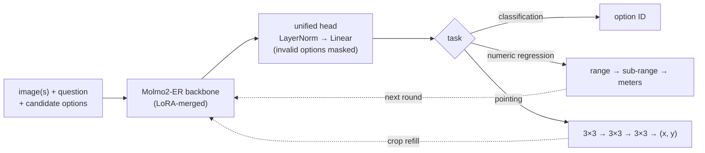

<div align="center">

# Jev-Spatial

**Fast spatial intelligence through finite-choice decisions**

[](https://github.com/Fr0zenCrane/jev-spatial)
[](https://huggingface.co/Fr0zencr4nE/jev-spatial)
[](https://huggingface.co/allenai/Molmo2-ER)
[](LICENSE)

English · [简体中文](README-zh.md)

</div>

**Jev-Spatial** is a *System One* spatial-intelligence model built on [Molmo2-ER](https://huggingface.co/allenai/Molmo2-ER). Inspired by [Jev](https://typesafe.ai/blog/introducing-system-one-models-and-jev), it gives spatial tasks one shared format: **images + question + candidate options → one decision**. All tasks go through one unified head, and the model never generates text.

Every task becomes a choice among a fixed set of options. The tasks fall into three families:

- **Classification** (spatial relations, directions, yes/no): a single choice among the given options.
- **Numeric regression** (lengths in meters): two rounds. First pick a value range, then a sub-range inside it.
- **Pointing**, a special case: three rounds of picking one cell in a 3×3 grid. After each of the first two rounds, the model zooms into the chosen cell.

Every output comes from a fixed set of options, so there is nothing to parse and no malformed output. Compared with the autoregressive (AR) baseline, i.e. our reproduction of native Molmo2-ER, Jev-Spatial:

- **performs about as well overall.** It is within a few points on classification and has lower error on metric estimation.
- **does better at pointing, which we didn't expect.** Picking grid cells coarse-to-fine works better than generating coordinates as text.
- when one image gets 8 questions, finishes them **~4.2× faster** than answering one question at a time with AR generation;
- runs at about the same speed as an AR baseline that also shares the image across questions, while **hitting the pointing target ~2.7× more often**.

> [!NOTE]
> Jev-Spatial is an independent research project. It follows the Jev idea of answering typed questions with choices instead of generated text. It is **not affiliated with, endorsed by, or derived from TypeSafe AI or its Jev model**, and it was not trained on Jev outputs.

---

## Highlights

- 🧭 **One interface for three task families.** Classification, numeric regression and pointing all use the same request format and the same classifier. Only the options and the number of rounds differ.
- 🤝 **As good as the base model overall.** Jev-Spatial only picks from a fixed set of options, yet it stays close to native AR everywhere. It is within 1–4 points on classification (CV-Bench −1.0, SAT −4.0) and has lower metric error on VST (0.472 vs. 0.520 m).
- 🎯 **A bonus on pointing.** Pointing is the one area where it actually does better than the base model: +2.0 on RefSpatial-Bench and +7.0 on Where2Place. Three rounds of 3×3 choices with fresh crops between rounds seem easier to learn than writing out coordinates as text.
- ⚡ **Fast when one image gets many questions.** The image is encoded once and its cache is shared, all questions run in parallel, and pointing crops from the same round are batched together. With 8 questions per image this is 2.1–3.6× faster than answering the questions one at a time.
- 🧱 **Output is always valid.** Every answer is one of the supplied options or is decoded from a sequence of choices, so parse failures and runaway outputs can't happen.
- 🔍 **Inspectable decisions.** Each prediction includes the full choice path and the classifier scores at every round.

## Motivation

Many everyday spatial questions are closer to **System 1** perception than to deliberate reasoning:

- Is the mug to the left of the laptop?
- How tall is that chair?
- Where can I place the cup?

A VLM already has the visual features and the image-text alignment needed to answer them. Making it describe its perception token by token, then parsing that text back into an answer, adds latency and new ways to fail.

Jev showed that many decisions can be read directly as a choice among typed options. Jev-Spatial applies the same idea to spatial perception. We hypothesize that restricting the output to a finite set of states also makes learning easier, because the model only has to rank a few options instead of producing a precise string. This may explain part of the pointing gains.

## Method



### How Jev-Spatial handles each task

All three task families end the same way: the unified head picks one option from a fixed set. They differ in what the options are, how many rounds it takes, and whether the image changes between rounds.

| Task family | `answer_space.kind` | Jev analogue | Options per round | Rounds | Image changes between rounds? | Output |
|---|---|---|---|---:|---|---|
| Classification | `choice` | Yes/no · Choice | The 2–N options in the request | 1 | — | Option ID |
| Numeric regression | `scalar` | Score (ordered levels) | Value ranges, then sub-ranges | 2 | No | Length in meters |
| Pointing | `point` | *(new)* | 9 cells of a 3×3 grid | 3 | **Yes (crop refill)** | Normalized `(x, y)` in $[0, 1]$ |

**Classification: one decision.** This covers spatial relations, directions and yes/no questions. The request supplies the candidate options. They are shuffled so the model can't learn to prefer a position, and the model picks one in a single pass. This is Jev's native setting and needs no adaptation.

**Numeric regression: pick a range, then narrow it down.** A continuous value is split into ordered ranges. Round 1 picks a coarse range, with separate classes for *exactly zero* and *above the maximum*. Round 2 picks a sub-range inside it, and the prediction is decoded from that sub-range. The image and question stay the same across both rounds; only the options change. Accuracy therefore depends on how the ranges are designed (see [Limitations](#limitations)).

**Pointing: a special case.** Pointing differs from the other two in two ways: its answer is a *location in the image*, and it is the only task where *the visual input changes between rounds*.

- Each round splits the current region into a 3×3 grid and picks one cell.
- After each of the first two rounds, the chosen cell is cropped from the original image, encoded again, and appended to the context, so the next round sees a zoomed-in view (*crop refill*).
- After three rounds the effective grid is 27×27. The final point is the center of the last cell, so each axis is resolved to $1/27 \approx 3.7\%$ of the image.

This zooming is what makes pointing work (see the ablation below). It is also where most of the extra compute goes.

### Key design choices

- **One head, one loss.** All tasks share one classifier trained with cross-entropy. The head outputs scores for up to `max_choices` options, and scores for options that don't exist in a request are masked out.
- **Answering many questions about one image.** The image is encoded once and its cached context is shared. Independent questions run in parallel from that cache, and crops that different pointing questions need in the same round are processed together in one batch.
- **Reused computation and no look-ahead.** Later rounds reuse the cached context from earlier rounds and only process new tokens. Image tokens can attend to each other only within the same round, which stops the model from seeing future crops.
- **Shuffled options.** For classification, the option order is shuffled with a fixed seed. Use `--preserve-option-order` to turn this off.

### Ablation: how the image is used across pointing rounds

We compared three ways to use the image across the three pointing rounds:

- **`single_image`:** reuse the original image in every round, add a description of the region selected so far, and reuse its cache.
- **`roi_mask`:** reuse the original image's cache, but block the new tokens from attending directly to image tokens outside the selected region.
- **`crop_refill`:** crop the selected region, encode it again, and append it to the existing context.

These are early checkpoints, not the released one. Each was trained for 300 steps and evaluated with 2-crop images and three 3×3 rounds. RefSpatial scores are region-hit rates on 200 questions.

| Variant | SAT real ↑ | VST MAE (m) ↓ | RefSpatial ↑ | Location ↑ | Placement ↑ |
|---|---:|---:|---:|---:|---:|
| `single_image` | **78.7** | 0.599 | 16.0 | 16.0 | 16.0 |
| `roi_mask` | 77.7 | 0.603 | 18.5 | 21.0 | 16.0 |
| **`crop_refill`** | 77.7 | **0.599** | **35.0** | **43.0** | **27.0** |

**Summary:** the choice of method barely affects classification or numeric regression. For pointing, `crop_refill` improves the region-hit rate by **+19.0 points** over `single_image`, while `roi_mask` improves it by only +2.5. The released model therefore uses `crop_refill`. All three variants are in `runtime.py` (`point_variant`).
<sub>Record: `artifacts/benchmarks/fast-v1-20260923T201259Z/comparison.json`</sub>

<details>
<summary><b>Image processing: what "24-crop" means</b></summary>

Molmo2-ER splits each image into local tiles and adds one global thumbnail, so it sees both fine detail and the overall layout. **24-crop** means *up to* 24 local tiles plus the thumbnail. The actual number depends on image size and aspect ratio. Pointing crops go through the same preprocessing, so each extra round adds compute.

</details>

### Training

| | |
|---|---|
| Data | **~72K QA pairs**: SAT ~25K · VST-P ~22K · RefSpatial ~25K |
| Trainable parameters | LoRA on the language model + the unified head |
| Frozen | Vision encoder and the projector that connects it to the language model |
| Hardware | 8 × A800 |
| Release | LoRA merged into the backbone (no PEFT needed at inference) |

## Results

### Accuracy

All image benchmarks use 24-crop and were run locally. Scores are percentages (↑ is better). VST reports mean absolute error in meters on 300 internal dev samples (↓ is better).

| Benchmark | Molmo2-ER (reproduced) | Naive three-head | **Jev-Spatial** | Δ vs. Molmo2-ER (reproduced) |
|---|---:|---:|---:|---:|
| SAT real ↑ | **79.3** | 77.7 | 75.3 | −4.0 |
| CV-Bench ↑ | **87.3** | 87.0 | 86.3 | −1.0 |
| RefSpatial-Bench ↑ | 52.5 | 9.0 | **54.5** | +2.0 |
| Where2Place ↑ | 57.0 | 26.0 | **64.0** | +7.0 |
| RoboSpatial-Pointing † ↑ | 29.5 | 4.1 | **59.8** | +30.3 |
| RoboSpatial-VQA † ↑ | 58.0 | 58.3 | **64.2** | +6.2 |
| VST dev MAE (m) ↓ | 0.520 | **0.428** | 0.472 | −9% error |

- **Naive three-head** is the first prototype. It had separate heads for classification, number regression and coordinate regression, and used less data and fewer training steps. It regresses metric values best but nearly fails at pointing.
- **The unified head** greatly improves pointing, loses a little on classification, and still trails the three-head baseline on numeric regression. See [Limitations](#limitations).

> [!WARNING]
> † **The RoboSpatial numbers are not yet verified.** Our native AR VQA score (58.0) is well below the published Molmo2-ER result (73.4). Treat these rows as provisional until the evaluation is fixed.

### Latency: many questions about one image

Jev-Spatial is fastest when one image gets many independent questions, which is common for robots and agents. We encode the image once and share its cached context, run all questions in parallel, and batch together the pointing crops needed in the same round. Pointing always uses the full three 3×3 rounds.

**Setup:** 20 images and 160 questions (8 per image) from RoboSpatial, covering spatial relations, whether an object can be placed somewhere, and pointing to free space. Single A800, each configuration repeated 3 times. The table reports the mean time until all 8 questions about one image are answered.

| Method | Inference mode | 2-crop, ms ↓ | 24-crop, ms ↓ | Pointing hit rate, 24-crop ↑ |
|---|---|---:|---:|---:|
| Molmo2-ER (reproduced) | one question at a time | 2848.0 | 5572.6 | 20.0% |
| Molmo2-ER (reproduced) | shared image, parallel | 717.9 | 1123.0 | 21.8% |
| Naive three-head | shared image, parallel | **148.3** | **527.1** | 7.3% |
| Jev-Spatial | one question at a time | 1397.6 | 4604.2 | 56.4% |
| **Jev-Spatial** | shared image, parallel | 675.7 | 1294.0 | **58.2%** |

Speedup from sharing the image, for Jev-Spatial:

| Questions per image | 1 | 2 | 4 | 8 |
|---|---:|---:|---:|---:|
| 2-crop | 18.6% slower | 1.18× | 1.58× | **2.07×** |
| 24-crop | 5.6% slower | 1.53× | 2.31× | **3.56×** |

**Summary**

1. **Much faster than answering one question at a time with AR.** With 8 questions per image, Jev-Spatial is **4.2× (2-crop) / 4.3× (24-crop)** faster than native AR answering them one by one, and hits the pointing target **~2.9× more often** (58.2% vs. 20.0%).
2. **Sharing the image pays off from 2 questions on.** The gain grows with the number of questions per image, up to 2.07× (2-crop) and 3.56× (24-crop) at 8 questions. With a single question there is nothing to share, so the extra overhead makes it slightly slower.
3. **Against AR that also shares the image, the advantage is quality, not speed.** When both sides share the image and run questions in parallel, Jev-Spatial is 1.06× faster at 2-crop and **15.2% slower at 24-crop**. The 24-crop slowdown comes from re-encoding the selected crops between rounds (see [Limitations](#limitations)). In return it hits the pointing target **2.7× more often** (58.2% vs. 21.8%).
4. **Numeric questions** (20 images × 2 questions each): sharing the image cuts Jev-Spatial's time from 378.0 to **295.7 ms** (1.28×). Native AR with the same sharing takes 347.2 ms. The naive three-head baseline is fastest overall, but its pointing hit rate collapses to 7.3%.

<sub>These speedups combine all three optimizations: sharing the image, running questions in parallel, and batching crops. In an early two-image test, crop batching alone saved only ~5.5% (24-crop, 8 questions per image: 1444.1 → 1365.0 ms), which is too small a test to count as a formal ablation. In BF16, parallel and one-by-one runs do not produce bit-identical outputs, so each quality number comes from that mode's own outputs. Record: `artifacts/benchmarks/scene-latency-20260924/comparison.json`</sub>

<details>
<summary><b>Latency with one question per request, per benchmark</b></summary>

Milliseconds per request, single A800 after warmup. 20 fixed samples per benchmark, each run 3 times; we take the median per sample and average. Timing covers image loading, preprocessing, inference and output parsing. Image tasks use 24-crop; VST uses 2-crop.

| Benchmark | Molmo2-ER (reproduced) | Naive three-head | **Jev-Spatial** |
|---|---:|---:|---:|
| SAT real | 504.3 | 461.2 | 484.3 |
| CV-Bench | 202.8 | 161.8 | 158.2 |
| RefSpatial-Bench | 741.4 | 127.9 | 306.1 |
| Where2Place | 1083.2 | 121.8 | 299.9 |
| RoboSpatial-Pointing | 986.8 | 464.8 | 772.9 |
| RoboSpatial-VQA | 542.5 | 463.2 | 471.1 |
| VST numeric dev | 300.1 | 111.8 | 187.4 |
| **Mean** (benchmarks weighted equally) | 623.0 | 273.2 | 382.9 |

With one question per request, classification speed is close to native AR. The biggest savings are on pointing benchmarks, where AR has to generate coordinate text: up to 3.6× faster on Where2Place. Reproduce with `scripts/benchmark_latency.py`.

</details>

## Quick start

### Install

Requires Python ≥ 3.10 and a CUDA GPU.

```bash
git clone https://github.com/Fr0zenCrane/jev-spatial
cd jev-spatial
pip install -e '.[inference]'
hf download Fr0zencr4nE/jev-spatial --local-dir models/jev-spatial
```

### Command line

```bash
jev-spatial --model models/jev-spatial --input examples/requests.jsonl
```

`--input` takes a single `.json` request or a `.jsonl` file with one request per line. Image paths are resolved relative to the request file.

| Flag | Description |
|---|---|
| `--output PATH` | Write results to a file instead of stdout |
| `--device` | Default `cuda:0` |
| `--max-crops N` | Override the Molmo2-ER crop limit (the release defaults to 2; the image benchmarks use 24) |
| `--max-sequence-length N` | Override the total token budget for all rounds |
| `--preserve-option-order` | Don't shuffle classification options |
| `--seed N` | Override the per-sample shuffle seed |

### Python

```python
from spatial_jev.inference import JevSpatial

model = JevSpatial.from_pretrained("models/jev-spatial", device="cuda:0")

# Classification: spatial relations, directions, yes/no
model.classify("examples/scene.png",
               "Where is the red square relative to the blue circle?",
               ["left", "right"])

# Numeric regression: nonnegative length in meters
model.measure("examples/scene.png", "How tall is the chair?", quantity="height")

# Pointing: one normalized (x, y) point in a single image
model.point("examples/scene.png", "Point to the blue circle.")
```

Image paths in the Python API are resolved relative to the current working directory.

### Request format

```jsonc
// classification: 2..max_choices options, each with a unique, nonempty id and text
{"media": [{"kind": "image", "uri": "scene.png"}],
 "question": "Where is the red square relative to the blue circle?",
 "answer_space": {"kind": "choice",
                  "options": [{"id": "left", "text": "left"},
                              {"id": "right", "text": "right"}]}}

// numeric regression: this checkpoint estimates nonnegative lengths in meters
{"media": [{"kind": "image", "uri": "scene.png"}],
 "question": "How tall is the chair?",
 "answer_space": {"kind": "scalar", "quantity": "height", "unit": "m"}}

// pointing: exactly one image and one point
{"media": [{"kind": "image", "uri": "scene.png"}],
 "question": "Point to the blue circle.",
 "answer_space": {"kind": "point", "coordinate_system": "normalized_xy", "num_points": 1}}
```

### Response format

| Field | Meaning |
|---|---|
| `prediction` | Option ID, a value in meters, or an `(x, y)` point |
| `path` | Index chosen at each round |
| `logits` | Classifier scores for every option at each round |
| `mapping` | How the shuffled options map back to the original ones (classification only) |
| `input_tokens` | Total input tokens across all rounds |

## Repository layout

```text
src/spatial_jev/
├── inference.py      # JevSpatial API + `jev-spatial` CLI
├── runtime.py        # multi-round inference, unified head, point variants
├── hierarchy.py      # scalar ranges and 3×3 grid encoding/decoding
├── schema.py         # request checks and prompt building
├── unified.py        # training model for the unified head
└── molmo2/           # bundled Molmo2 model and processor code (no remote code)
scripts/              # data prep, training, evaluation, latency, export
configs/              # pilot_v0 (three-head), unified_v1, mixed_v2
data/manifests/       # dataset and benchmark source lists
tests/
```

## Limitations

- **Compute and data.** Jev-Spatial was trained for a short time on ~72K QA pairs. It keeps much of the base model's ability, but its robustness hasn't been tested widely.
- **Numeric regression.** Metric estimation turns a continuous value into two classification rounds over value ranges, so accuracy depends on how the ranges are designed. The current ranges come from a small sample and are close to a toy setup. A general version needs larger metric datasets, representative value ranges, and explicit handling of extreme values. This is the main reason the VST error is still higher than that of the naive three-head baseline, which predicts the number directly.
- **Image cropping cost.** After each of the first two pointing rounds, the selected region is cropped and run through Molmo2-ER's full image preprocessing again. At 24-crop, each of these crops can itself be split into up to 24 tiles, so the cost grows with every refinement round. This is why Jev-Spatial is 15.2% slower at 24-crop than the AR baseline when both share the image across questions. We haven't yet studied how 24-crop tiling interacts with per-round cropping, or whether the crops need that many tiles at all.
- **Pointing precision.** Three rounds of 3×3 choices limit precision to 1/27 of each axis, and we haven't tested adding more rounds. Training mostly uses a single annotated point per example.

## Acknowledgements

Special thanks to **[Molmo2-ER](https://huggingface.co/allenai/Molmo2-ER)**, which provides the spatial understanding, and to **[Jev](https://typesafe.ai/blog/introducing-system-one-models-and-jev)**, which inspired the decision-based approach.

We also thank [Molmo2](https://github.com/allenai/molmo2), [MolmoAct2](https://github.com/allenai/molmoact2), [Qwen](https://github.com/QwenLM/Qwen3), [SigLIP 2](https://huggingface.co/google/siglip2-so400m-patch14-384), and the open Jev-style community projects [jev-visual](https://github.com/hr98w/jev-visual), [Jev-Omni](https://huggingface.co/akhilaaa3/Jev-Omni), [Qwen-2.5-1B-RLCD](https://huggingface.co/harshatheg/Qwen-2.5-1B-RLCD), [OpenJev](https://github.com/razorback16/openjev), [OmniJev](https://github.com/shapsider/OmniJev), [OpenJev-Vision](https://github.com/IamBusy/OpenJev-Vision), and [SemIf](https://github.com/TheoLeeCJ/SemIf).

Data and benchmarks: [SAT](https://huggingface.co/datasets/array/SAT), [VST](https://huggingface.co/datasets/rayruiyang/vst_500k), [RefSpatial / RoboRefer](https://github.com/Zhoues/RoboRefer), [CV-Bench](https://huggingface.co/datasets/nyu-visionx/CV-Bench), [RoboPoint / Where2Place](https://github.com/wentaoyuan/RoboPoint), [RoboSpatial](https://github.com/chanhee-luke/RoboSpatial-Eval), [VSI-Bench](https://github.com/vision-x-nyu/thinking-in-space), and the original scene datasets. Tooling: PyTorch, Transformers, PEFT, Safetensors.

## Citation

```bibtex
@misc{jevspatial2026,
  title        = {Jev-Spatial: Fast Spatial Intelligence through Finite-Choice Decisions},
  author       = {Fr0zenCrane},
  year         = {2026},
  howpublished = {\url{https://github.com/Fr0zenCrane/jev-spatial}}
}
```

## License

Code and weights: [Apache-2.0](LICENSE). See [NOTICE](NOTICE) for third-party attributions. Datasets keep their own licenses.
